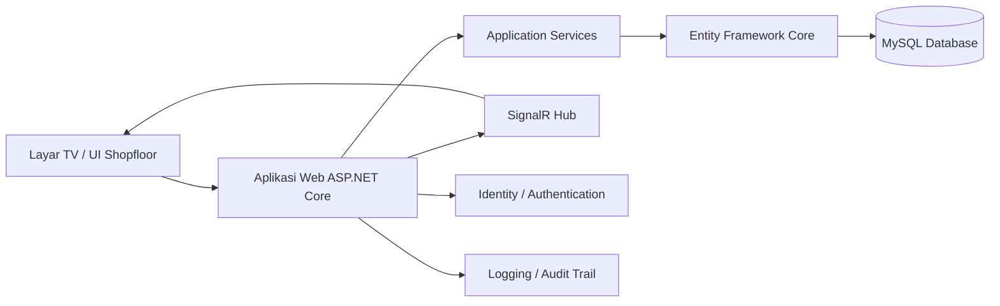
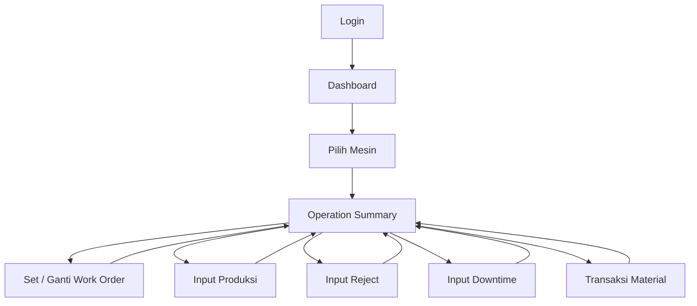
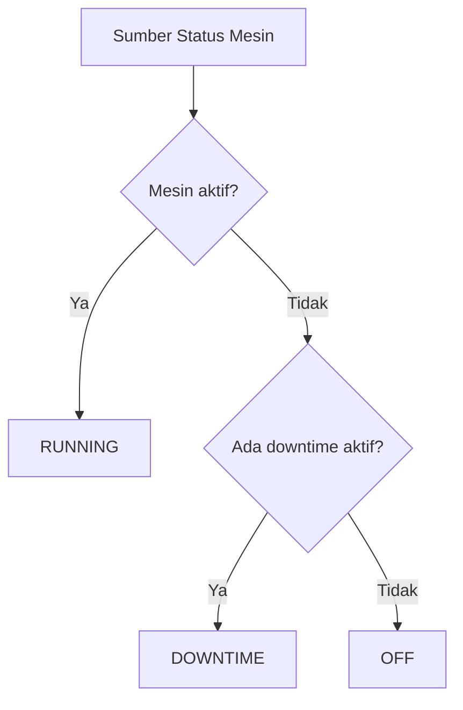
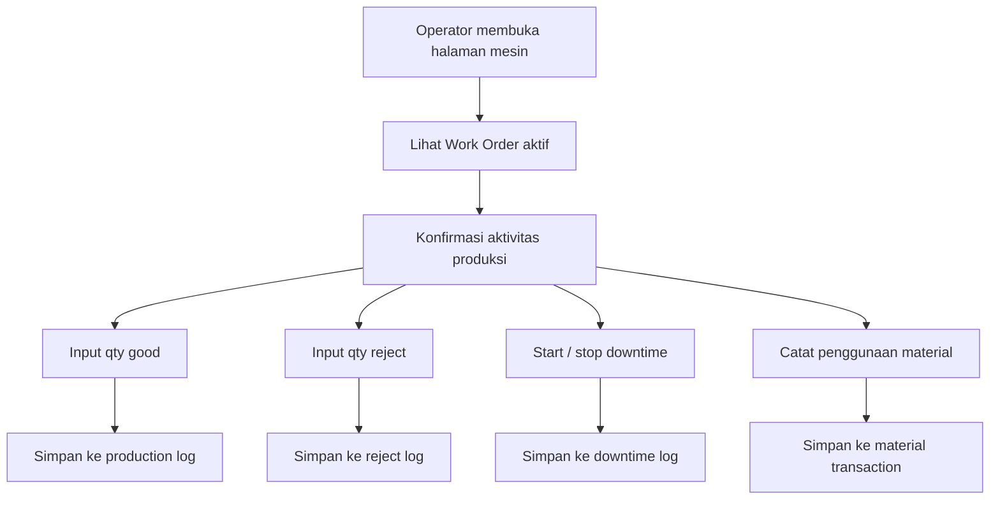
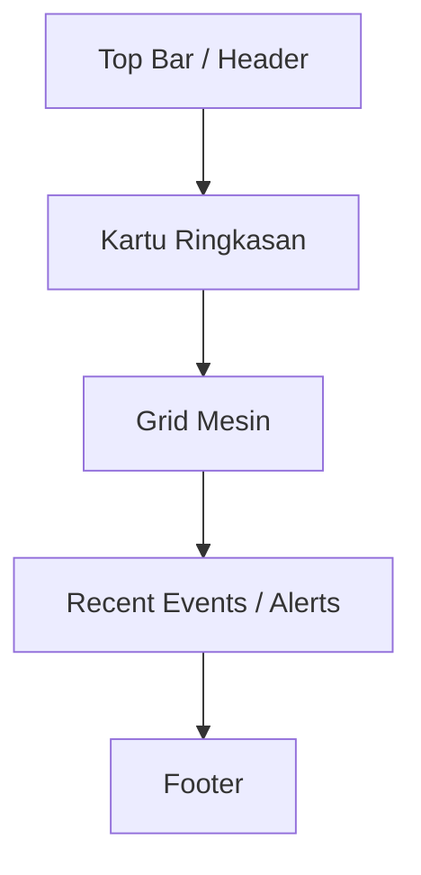
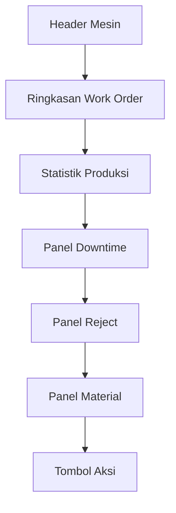
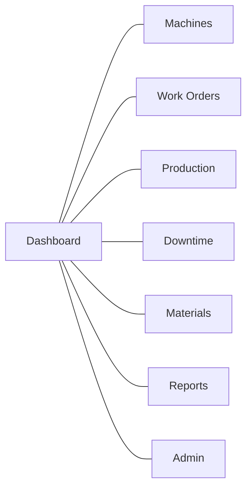
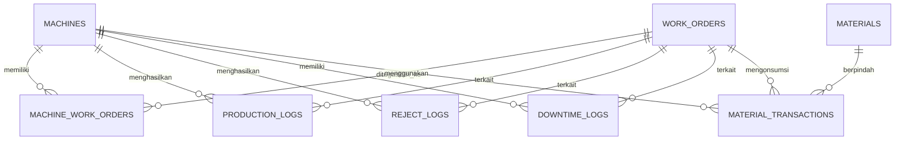

# Brief Proyek — Sistem Work Order & Monitoring Mesin (MES Light)

**Tipe Dokumen:** Brief Teknis Proyek  
**Target Platform:** Sistem monitoring dan eksekusi produksi berbasis web  
**Stack Utama:** ASP.NET Core, Bootstrap, MySQL  
**Versi:** 1.0  
**Status:** Draft untuk Development

---

## 1. Ringkasan Eksekutif

Proyek ini adalah sistem manufaktur berbasis web yang dirancang untuk mengelola **Work Order**, memantau **status mesin**, mencatat **output produksi**, merekam **reject dan downtime**, serta melakukan **tracking material** di lingkungan produksi.

Sistem akan dipakai di area shopfloor, dengan tampilan utama pada TV besar untuk monitoring mesin, dan PC/tablet untuk input operator. Sistem harus cukup sederhana untuk operasional harian, tetapi tetap terstruktur agar memenuhi kebutuhan industri seperti traceability, audit trail, dan pengembangan lanjutan.

---

## 2. Latar Belakang Proyek

Di banyak pabrik manufaktur, monitoring produksi masih dilakukan secara manual atau semi-digital. Masalah yang umum terjadi antara lain:

- Status mesin tidak terlihat dalam satu tampilan terpusat.
- Eksekusi Work Order tidak tercatat secara konsisten.
- Output produksi diinput manual tanpa traceability yang baik.
- Data reject dan downtime sulit dianalisis.
- Konsumsi material tidak terhubung langsung ke Work Order.
- Supervisor harus bertanya ke operator untuk mengetahui kondisi mesin.

Proyek ini dibuat untuk membangun **sistem monitoring dan eksekusi produksi terpusat** yang dapat dipakai langsung di shopfloor.

---

## 3. Pernyataan Masalah

### 3.1 Masalah Saat Ini

1. Status mesin tersebar di beberapa sumber.
2. Informasi Work Order hanya ditampilkan, belum menjadi alur eksekusi produksi yang rapi.
3. Input produksi masih manual dan sering tidak konsisten.
4. Data downtime dan reject sulit direkap.
5. Tracking material belum terhubung langsung ke Work Order.
6. Data historis sulit dicari dan dilaporkan.
7. Tampilan shopfloor hanya informatif, belum sepenuhnya operasional.

### 3.2 Masalah Inti yang Harus Diselesaikan

- Bagaimana menampilkan semua mesin dalam satu dashboard dengan status yang akurat.
- Bagaimana saat satu mesin diklik, sistem menampilkan operation summary mesin tersebut.
- Bagaimana operator dapat menginput produksi, reject, dan downtime.
- Bagaimana Work Order terhubung dengan eksekusi mesin dan material.
- Bagaimana sistem disusun agar siap berkembang menjadi MES yang lebih lengkap.

---

## 4. Tujuan Proyek

1. Membangun dashboard produksi yang menampilkan semua mesin dan statusnya.
2. Menyediakan halaman detail mesin yang menampilkan Work Order aktif dan operation summary.
3. Memungkinkan operator menginput produksi, reject, downtime, dan transaksi material.
4. Menyimpan semua data operasional dengan audit trail yang jelas.
5. Merancang sistem yang mudah dipelihara dan mudah dikembangkan.
6. Menggunakan stack teknologi yang umum dan sesuai standar industri.

---

## 5. Ruang Lingkup Proyek

### 5.1 Termasuk Dalam Scope

- Dashboard mesin
- Operation summary mesin
- Manajemen Work Order
- Input produksi
- Input reject
- Input downtime
- Tracking material
- Reporting dasar
- Authentication dan role-based access
- Audit logging
- UI responsif untuk TV dan desktop

### 5.2 Tidak Termasuk Pada Rilis Awal

- Integrasi langsung ke PLC/SCADA
- Predictive maintenance
- Analitik berbasis AI
- Sinkronisasi ERP yang kompleks
- Engine penjadwalan lanjutan
- Aplikasi mobile

### 5.3 Kandidat Pengembangan Lanjutan

- Integrasi mesin real-time
- Perhitungan OEE
- Integrasi ERP
- Scanning barcode / QR untuk material
- Sistem notifikasi dan alert
- Dukungan multi-plant

---

## 6. Tech Stack yang Direkomendasikan

### 6.1 Backend

- **ASP.NET Core MVC**
- **Entity Framework Core**
- **ASP.NET Core Identity**
- **SignalR**
- **Serilog** atau structured logging bawaan

### 6.2 Frontend

- **Bootstrap 5**
- **Razor Views**
- Opsional: **Chart.js** untuk grafik ringkasan
- Opsional: **JavaScript / jQuery** untuk interaksi sederhana

### 6.3 Database

- **MySQL 8.x**

### 6.4 Tools Pendukung

- Visual Studio
- Git + GitHub
- MySQL Workbench
- Postman atau Swagger untuk pengujian API
- Figma atau tools desain UI lain
- IIS untuk deployment
- Windows Server untuk production hosting

---

## 7. Peran Pengguna

### 7.1 Admin

Tanggung jawab:

- Mengelola user dan role
- Memelihara master data
- Mengatur konfigurasi sistem
- Melihat semua log dan report

### 7.2 Supervisor / Production Leader

Tanggung jawab:

- Memantau status mesin
- Meninjau Work Order
- Memvalidasi progress produksi
- Meninjau downtime dan reject

### 7.3 Operator

Tanggung jawab:

- Melihat mesin yang ditugaskan
- Menginput output produksi
- Mencatat reject
- Mencatat downtime
- Memilih / mengonfirmasi Work Order

### 7.4 Engineer / Maintenance (Opsional)

Tanggung jawab:

- Meninjau penyebab downtime
- Membantu penyelesaian masalah mesin
- Menganalisis data gangguan produksi

---

## 8. Arsitektur Sistem Tingkat Tinggi



### Catatan Arsitektur

- Layar TV hanya salah satu media tampilan.
- Aturan bisnis utama berada di backend service.
- SignalR digunakan agar status mesin bisa diperbarui nyaris real-time.
- Semua aktivitas produksi disimpan ke database lengkap dengan timestamp dan identitas user.

---

## 9. Alur Aplikasi

### 9.1 Alur Utama



### 9.2 Alur Status Mesin



### 9.3 Alur Kerja Operator



---

## 10. Fitur Inti

## 10.1 Ringkasan Dashboard

Dashboard harus menampilkan:

- Nama mesin
- Status mesin
- Work Order aktif
- Target vs actual produksi
- Indikator ringkas
- Kondisi mesin dengan warna

### Aturan Status

- **RUNNING** = mesin aktif dan sedang produksi
- **DOWNTIME** = mesin berhenti dengan alasan aktif
- **OFF** = mesin tidak aktif dan tidak ada downtime terbuka

### Widget Tambahan Dashboard

Dashboard juga harus menampilkan:

- Top 5 mesin berdasarkan OEE
- Top 5 mesin berdasarkan output
- Top 5 mesin berdasarkan downtime
- Kartu ringkasan plant:
  - total mesin
  - running
  - downtime
  - off
  - average OEE

#### Aturan Ranking Top 5 Mesin

Ranking dapat didasarkan pada satu metrik yang dipilih:

- OEE
- total output
- downtime terendah
- performance tertinggi

Rekomendasi default:

- **Top 5 berdasarkan OEE** untuk visibilitas manajemen
- Opsional filter berdasarkan rentang tanggal dan shift

---

## 10.2 Operation Summary Mesin

Saat user mengklik sebuah mesin, sistem membuka halaman detail berisi:

- Work Order ID
- Toy No
- Target
- Part Number
- Panel
- Status mesin saat ini
- Progress produksi
- Jumlah reject
- Informasi downtime aktif
- Ringkasan penggunaan material
- Availability
- Performance
- Quality
- OEE
- Rincian runtime / uptime / downtime
- Rincian cycle:
  - standard cycle
  - average cycle
  - last cycle

Halaman ini juga harus menyediakan tombol untuk:

- Downtime
- Reject
- Work Order
- Input produksi
- Input material

---

## 10.3 Manajemen Work Order

Modul Work Order harus mendukung:

- Membuat Work Order baru
- Mengubah Work Order
- Menugaskan Work Order ke mesin
- Menutup Work Order
- Membuka kembali / hold Work Order jika diperlukan
- Pencarian berdasarkan nomor WO, part number, atau mesin

### Contoh Field Work Order

- Nomor WO
- Toy No
- Part Number
- Panel
- Target quantity
- Start date
- End date
- Assignment mesin
- Status

---

## 10.4 Input Produksi

Modul produksi harus mendukung:

- Input qty good
- Input qty reject
- Pencatatan timestamp
- Pencatatan user
- Keterkaitan mesin dan WO
- Pencatatan shift (opsional)

### Aturan

- Qty good dan qty reject harus tidak negatif.
- Input produksi harus selalu terhubung ke mesin dan Work Order aktif.
- Setiap transaksi wajib dicatat.

---

## 10.5 Manajemen Downtime

Modul downtime harus mendukung:

- Start downtime
- End downtime
- Pemilihan reason downtime
- Perhitungan durasi
- Catatan tambahan bila diperlukan

### Aturan

- Downtime aktif hanya boleh satu pada satu mesin dalam satu waktu.
- End time tidak boleh lebih kecil dari start time.
- Daftar reason harus distandarkan.

---

## 10.6 Tracking Material

Modul material harus mendukung:

- Issue material ke WO
- Return material sisa
- Pencatatan konsumsi material
- Nomor batch / lot opsional
- Referensi gudang opsional

### Arah Traceability Masa Depan

- Material lot → WO → mesin → produk jadi
- Ini penting untuk traceability industri dan audit kualitas.

---

## 10.7 Reporting

Report yang harus tersedia:

- Produksi per mesin
- Produksi per Work Order
- Ringkasan reject
- Ringkasan downtime
- Ringkasan penggunaan material
- Report harian / shift
- Ringkasan OEE per mesin
- Top 5 mesin berdasarkan OEE
- Grafik tren per shift / hari / rentang tanggal

---

## 10.8 Audit Trail

Setiap aksi penting harus menyimpan:

- Siapa yang melakukan
- Kapan terjadi
- Pada mesin apa
- Pada Work Order apa
- Nilai lama / nilai baru jika relevan

---

## 10.9 Monitoring OEE

Dashboard dan halaman detail mesin harus mendukung metrik OEE.

### Metrik yang Dibutuhkan

#### Availability

Field yang disarankan:

- uptime
- downtime
- available (%)

#### Performance

Field yang disarankan:

- standard cycle
- average cycle
- last cycle
- performance (%)

#### Quality

Field yang disarankan:

- good qty
- reject qty
- quality (%)

#### Overall Equipment Effectiveness

- OEE (%)

### Aturan Perhitungan yang Direkomendasikan

Gunakan definisi plant yang disepakati dan konsisten di seluruh sistem.

Implementasi praktis yang umum:

- **Availability %** = `runtime / planned_production_time × 100`
- **Performance %** = `(standard_cycle_time × total_output) / runtime × 100`
- **Quality %** = `good_qty / total_output × 100`
- **OEE %** = `Availability × Performance × Quality / 10000`

Dengan:

- `total_output = good_qty + reject_qty`
- `runtime` adalah waktu running aktual untuk produksi
- `planned_production_time` adalah waktu produksi terjadwal setelah mengikuti aturan plant

### Detail OEE yang Harus Ditampilkan

- Persentase availability
- Runtime
- Uptime
- Downtime
- Persentase performance
- Standard cycle
- Average cycle
- Last cycle
- Persentase quality
- Persentase OEE

---

## 11. Rencana UI / UX

## 11.1 Prinsip UI

Antarmuka harus:

- Cepat dipahami
- Minim typing
- Ukuran cukup besar untuk layar TV
- Mudah dipakai operator di area produksi
- Status jelas dengan hierarki visual yang kuat

## 11.2 Arah Desain Visual

- Industrial, bersih, dan fungsional
- Hindari dekorasi berlebihan
- Gunakan spacing dan tipografi yang jelas
- Gunakan warna status secara konsisten
- Layout kartu untuk tile mesin

### Saran Warna Status

- RUNNING: Hijau
- DOWNTIME: Merah / Oranye
- OFF: Abu-abu
- WARNING / HOLD: Kuning

---

## 11.3 Rencana Layout

### A. Halaman Dashboard

Dashboard harus berisi:

- Header dengan informasi plant / line
- Kartu ringkasan
- Kartu ringkasan OEE
- Widget ranking Top 5 mesin
- Grid mesin
- Waktu update terakhir
- Filter cepat opsional

#### Contoh Layout



### B. Halaman Detail Mesin

Halaman detail mesin harus berisi:

- Header mesin
- Blok ringkasan Work Order
- Counter produksi
- Blok downtime
- Blok reject
- Blok material
- Tombol aksi

#### Contoh Layout



---

## 11.4 Rencana Navigasi

### Navigasi Utama

- Dashboard
- Work Orders
- Machines
- Production Logs
- Downtime Logs
- Materials
- Reports
- Users / Roles
- Settings

### Struktur Navigasi yang Disarankan



### Aturan Navigasi

- Dashboard harus dapat dibuka dalam satu klik.
- Detail mesin harus terbuka dari klik tile mesin.
- Menu admin hanya muncul untuk user yang berhak.
- Pada tampilan TV, navigasi harus dipangkas seminimal mungkin.

---

## 11.5 Perilaku Responsif

- **Layar TV:** hanya dashboard, kartu besar, interaksi minimal
- **Desktop PC:** dashboard + manajemen detail + input data
- **Tablet:** tampilan detail yang disederhanakan dan tombol aksi
- **Mobile (opsional):** read-only atau aksi operator terbatas

---

## 12. Rencana Backend

## 12.1 Arsitektur Backend

Backend harus menggunakan arsitektur berlapis:

- **Presentation Layer**: view MVC, controller
- **Application Layer**: business service
- **Domain Layer**: entity dan business rule
- **Infrastructure Layer**: EF Core, MySQL, logging, identity

## 12.2 Modul Backend yang Direkomendasikan

1. Authentication & Authorization
2. Machine Management
3. Work Order Management
4. Production Logging
5. Reject Logging
6. Downtime Logging
7. Material Tracking
8. Reporting
9. Notification / Real-time Update
10. Audit Logging

---

## 12.3 Rencana API

Walaupun aplikasi berbasis MVC, backend tetap sebaiknya disusun dengan batas layanan bergaya API agar mudah dikembangkan nanti.

### API Mesin

- `GET /api/machines`
- `GET /api/machines/{id}`
- `POST /api/machines`
- `PUT /api/machines/{id}`
- `PATCH /api/machines/{id}/status`

### API Work Order

- `GET /api/workorders`
- `GET /api/workorders/{id}`
- `POST /api/workorders`
- `PUT /api/workorders/{id}`
- `POST /api/workorders/{id}/assign-machine`
- `POST /api/workorders/{id}/close`

### API Produksi

- `POST /api/production`
- `GET /api/production/machine/{id}`
- `GET /api/production/workorder/{id}`

### API Reject

- `POST /api/rejects`
- `GET /api/rejects/machine/{id}`

### API Downtime

- `POST /api/downtimes/start`
- `POST /api/downtimes/end`
- `GET /api/downtimes/machine/{id}`

### API Material

- `POST /api/material-transactions`
- `GET /api/material-transactions/machine/{id}`
- `GET /api/material-transactions/workorder/{id}`

### API Report

- `GET /api/reports/daily`
- `GET /api/reports/machine-summary`
- `GET /api/reports/workorder-summary`
- `GET /api/reports/oee-summary`
- `GET /api/reports/top-machines`
- `GET /api/reports/top-machines?metric=oee&dateFrom=YYYY-MM-DD&dateTo=YYYY-MM-DD`

---

## 12.4 Rencana SignalR / Real-Time

Gunakan SignalR untuk:

- update status mesin
- refresh counter produksi
- perubahan status downtime
- perubahan Work Order
- alert dashboard

### Contoh Event Real-Time

- status mesin berubah
- input produksi tersimpan
- downtime dimulai
- downtime selesai
- Work Order diganti

---

## 12.5 Background Job

Background service dapat dipakai untuk:

- recalculation status
- generate ringkasan harian
- pembersihan data terjadwal
- sinkronisasi data
- generate alert

---

## 13. Rencana Database

## 13.1 Prinsip Desain Database

- Normalisasi data transaksi inti
- Pisahkan master data dan data transaksi
- Tambahkan field audit di semua tabel penting
- Gunakan penamaan yang konsisten
- Tambahkan index pada field yang sering dipakai filter dan join

---

## 13.2 Tabel Inti

### machines

Menyimpan master data mesin.

Kolom yang disarankan:

- id
- machine_code
- machine_name
- line_name
- status
- is_active
- created_at
- updated_at

---

### work_orders

Menyimpan master dan data eksekusi Work Order.

Kolom yang disarankan:

- id
- wo_number
- toy_no
- part_number
- panel
- target_qty
- start_date
- end_date
- status
- created_at
- updated_at

---

### machine_work_orders

Menyimpan histori penugasan mesin.

Kolom yang disarankan:

- id
- machine_id
- work_order_id
- start_time
- end_time
- status
- assigned_by
- created_at

---

### production_logs

Menyimpan transaksi output produksi.

Kolom yang disarankan:

- id
- machine_id
- work_order_id
- qty_good
- shift_name
- notes
- created_by
- created_at

---

### reject_logs

Menyimpan transaksi reject.

Kolom yang disarankan:

- id
- machine_id
- work_order_id
- qty_reject
- reject_reason
- notes
- created_by
- created_at

---

### downtime_logs

Menyimpan kejadian downtime.

Kolom yang disarankan:

- id
- machine_id
- work_order_id
- downtime_reason_id
- start_time
- end_time
- duration_minutes
- notes
- created_by
- created_at

---

### materials

Menyimpan master data material.

Kolom yang disarankan:

- id
- material_code
- material_name
- unit
- is_active
- created_at
- updated_at

---

### material_transactions

Menyimpan pergerakan material.

Kolom yang disarankan:

- id
- material_id
- work_order_id
- machine_id
- transaction_type
- qty
- batch_no
- notes
- created_by
- created_at

---

### downtime_reasons

Menyimpan daftar reason downtime yang distandarkan.

Kolom yang disarankan:

- id
- reason_code
- reason_name
- category
- is_active

#### Daftar Reason yang Direkomendasikan

- operational downtime
- connectivity
- changeover
- plan downtime
- call mechanic
- break
- external constraints
- planned maintenance
- running
- out of cycle
- machine off / no schedule

---

### oee_snapshots

Menyimpan snapshot OEE untuk reporting dan analisis histori.

Kolom yang disarankan:

- id
- machine_id
- work_order_id
- snapshot_date
- runtime_minutes
- uptime_minutes
- downtime_minutes
- availability_pct
- standard_cycle
- average_cycle
- last_cycle
- performance_pct
- good_qty
- reject_qty
- quality_pct
- oee_pct
- created_at

### users / roles

Gunakan tabel bawaan ASP.NET Core Identity untuk authentication dan authorization.

---

## 13.3 Gambaran Relasi



---

## 13.4 Aturan Database

- Satu mesin hanya boleh memiliki satu Work Order aktif pada satu waktu, kecuali aturan bisnis mengizinkan.
- Satu mesin hanya boleh memiliki satu downtime terbuka pada satu waktu.
- Semua nilai kuantitas harus non-negatif.
- Setiap transaksi harus memiliki timestamp dan user ID.
- Setiap update status harus dapat ditelusuri.

---

## 14. Aturan Bisnis

1. Mesin dapat berstatus **Running**, **Off**, atau **Downtime**.
2. Mesin harus selalu memiliki state aktif yang jelas.
3. Input produksi harus terhubung ke Work Order aktif.
4. Input reject harus mereferensikan mesin dan Work Order.
5. Downtime harus memiliki reason dan rentang waktu.
6. Issue material harus terhubung ke Work Order.
7. Saat Work Order ditutup, data eksekusi harus dikunci.
8. Riwayat tidak boleh di-overwrite; harus ditambahkan atau di-versioning.

---

## 15. Aturan Validasi

### Validasi Input

- Nomor WO harus unik.
- Target quantity harus lebih besar dari nol.
- Qty produksi dan reject harus berupa integer yang valid.
- End time downtime harus lebih besar dari start time.
- Assignment mesin harus valid dan aktif.
- Qty material tidak boleh melebihi stok saat ini kecuali aturan bisnis mengizinkan.

### Validasi UI

- Nonaktifkan aksi yang tidak relevan saat mesin off.
- Tampilkan peringatan jika tidak ada WO aktif.
- Minta konfirmasi sebelum menutup downtime atau WO.
- Gunakan dropdown untuk field standar.

---

## 16. Kebutuhan Non-Fungsional

### Performa

- Dashboard harus cepat dibuka.
- Kartu mesin harus update secara efisien.
- Query harus diindeks untuk filter umum.

### Keandalan

- Data tidak boleh hilang saat refresh.
- Transaksi harus disimpan secara atomik.

### Maintainability

- Kode harus modular.
- Service harus dipisahkan dari view.
- Migration database harus digunakan dengan benar.

### Keamanan

- Login wajib untuk aksi operator.
- Role-based access harus ditegakkan.
- Aksi sensitif harus dicatat.

### Kemudahan Pakai

- Tombol harus besar untuk area produksi.
- Jumlah langkah operator harus minimal.
- Label dan warna harus jelas.

---

## 17. Roadmap Development

## Fase 1 — Fondasi

- Setup project ASP.NET Core
- Setup MySQL
- Setup EF Core
- Setup Identity
- Setup layout Bootstrap
- Buat navigasi dasar

## Fase 2 — Master Data

- CRUD mesin
- CRUD Work Order
- Master material
- Master reason downtime
- Manajemen user / role

## Fase 3 — Core Eksekusi

- Tile dashboard mesin
- Halaman detail mesin
- Input produksi
- Input reject
- Input downtime
- Assignment Work Order

## Fase 4 — Tracking Material

- Layar transaksi material
- Penggunaan material per Work Order
- Report material

## Fase 5 — Real-Time dan Reporting

- Update SignalR
- Kartu ringkasan
- Report harian
- Histori mesin
- Ringkasan Work Order

## Fase 6 — Penguatan Sistem

- Peningkatan validasi
- Audit log
- Exception handling
- Peningkatan logging
- UAT bersama user produksi

## Fase 7 — Deployment

- Publish ke IIS
- Connection string production
- Konfigurasi environment
- Strategi backup
- Monitoring

---

## 18. Rencana Testing

### Unit Testing

Uji:

- logika bisnis
- kalkulasi status
- validasi transaksi

### Integration Testing

Uji:

- koneksi database
- alur CRUD
- assignment Work Order
- penyimpanan produksi dan downtime

### User Acceptance Testing

Uji dengan:

- operator
- supervisor
- admin

### Scenario Testing

- mesin running dan input produksi
- mesin downtime start/stop
- ganti WO saat eksekusi
- logging reject
- alur transaksi material

---

## 19. Rencana Deployment

### Pemisahan Environment

- Development
- Staging
- Production

### Target Deployment

- IIS pada Windows Server
- Server MySQL production
- Reverse proxy opsional jika dibutuhkan

### Checklist Production

- connection string benar
- logging aktif
- error page dikonfigurasi
- backup database terjadwal
- role user divalidasi
- health check berjalan

---

## 20. Risiko dan Mitigasi

| Risiko                    | Dampak               | Mitigasi                                         |
| ------------------------- | -------------------- | ------------------------------------------------ |
| Human error saat input    | Data tidak akurat    | Validasi, UI sederhana, sedikit field            |
| User menolak sistem       | Sistem tidak dipakai | UI sederhana, training, alur ramah operator      |
| Struktur data buruk       | Sulit dirawat        | Schema rapi, layered architecture                |
| Dashboard lambat          | Pengalaman buruk     | Indexing, pagination, refresh SignalR seperlunya |
| Aturan bisnis belum jelas | Membingungkan        | Finalisasi aturan sebelum development            |
| Scope melebar             | Rilis terlambat      | Prioritaskan core feature terlebih dahulu        |

---

## 21. Keputusan Desain yang Direkomendasikan

1. Mulai dari **input manual** dulu sebelum integrasi mesin.
2. Fokus ke **alur detail satu mesin** sebelum membangun laporan lanjutan.
3. Dashboard TV dibuat sederhana dan cepat.
4. Gunakan **status berbasis database** alih-alih logika hardcode.
5. Bangun dengan struktur berlapis agar mudah dikembangkan.
6. Kurangi jumlah klik untuk aksi operator.
7. Catat semua aksi penting.

---

## 22. Definition of Done

Project awal dianggap selesai apabila:

- User bisa login.
- Dashboard menampilkan semua mesin.
- User bisa membuka halaman detail mesin.
- User bisa assign atau melihat Work Order.
- User bisa input output produksi.
- User bisa input reject.
- User bisa mencatat downtime.
- User bisa mengelola transaksi material.
- Report bisa dibuat.
- Ringkasan OEE tersedia.
- Top 5 mesin dapat ditampilkan di dashboard.
- Data tersimpan aman di MySQL.
- Sistem dapat di-deploy ke IIS.

---

## 23. Struktur Repository yang Disarankan

```text
/src
  /Web
    Controllers
    Views
    wwwroot
    Hubs
  /Application
    Services
    DTOs
    Interfaces
  /Domain
    Entities
    Enums
    ValueObjects
  /Infrastructure
    Data
    Migrations
    Repositories
    Logging
  /Tests
    UnitTests
    IntegrationTests
/docs
  project-brief.md
  architecture.md
  api-spec.md
  database-design.md
```

---

## 24. Catatan Akhir

Proyek ini sebaiknya dibangun sebagai **sistem web industri yang siap produksi**, bukan sekadar prototype. Rilis awal harus sederhana, stabil, dan sesuai workflow operator yang benar-benar dipakai di pabrik. Setelah alur inti stabil, sistem dapat dikembangkan menjadi platform MES yang lebih lengkap.

Prinsip terpenting adalah:

> **Bangun alur kerja yang benar-benar dipakai pabrik.  
> Setelah itu, tingkatkan secara bertahap.**

---

## 25. Lampiran — Urutan Implementasi Awal yang Disarankan

1. Login dan akses role
2. Master mesin
3. Master Work Order
4. Tile dashboard mesin
5. Halaman detail mesin
6. Input produksi
7. Input reject
8. Input downtime
9. Input transaksi material
10. Report
11. Refresh real-time
12. Hardening dan deployment
