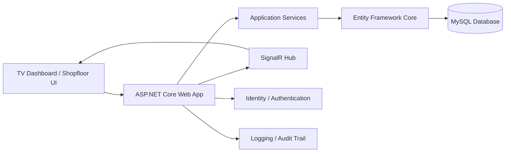
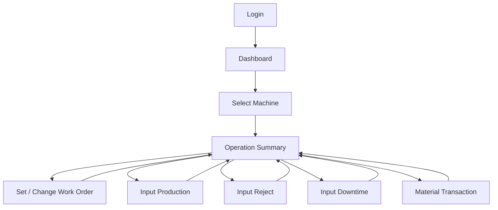
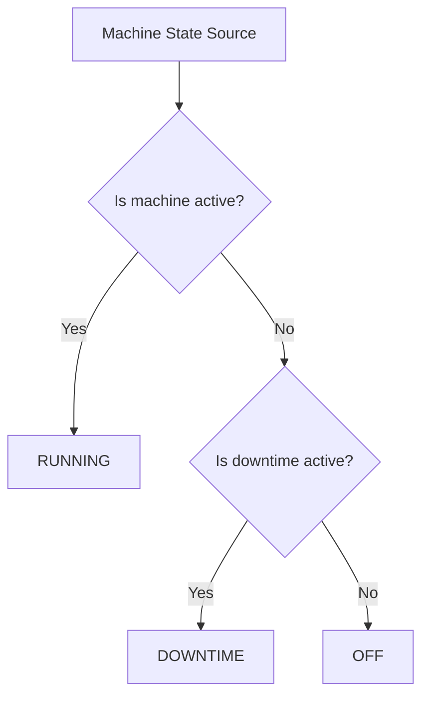
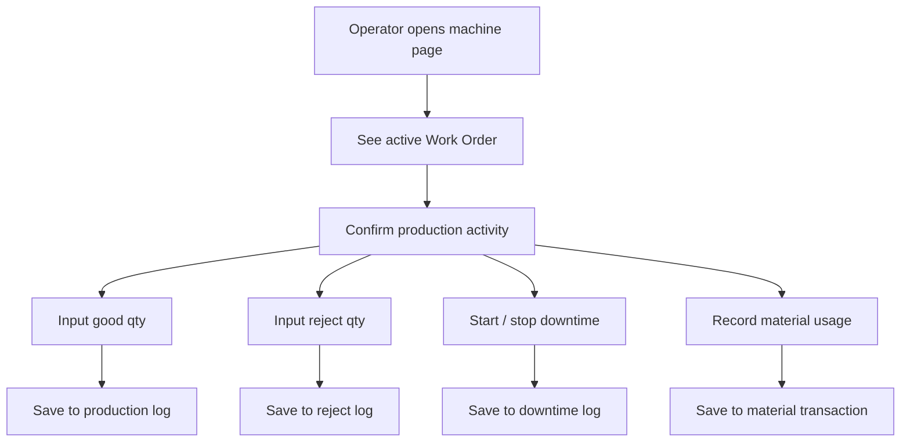
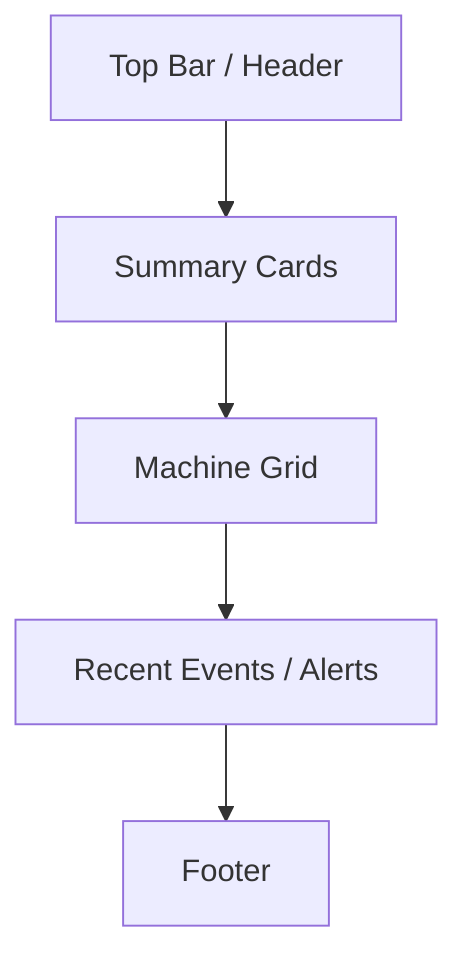
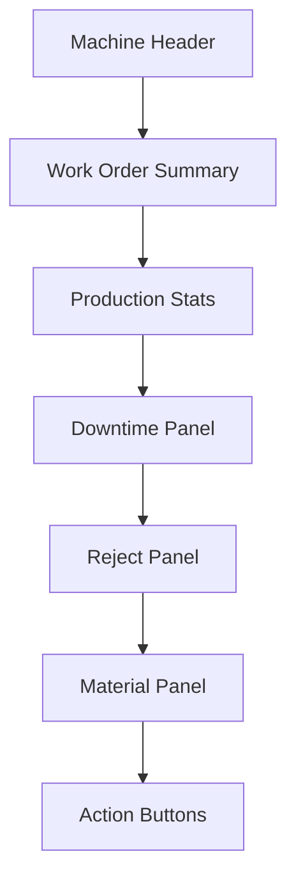
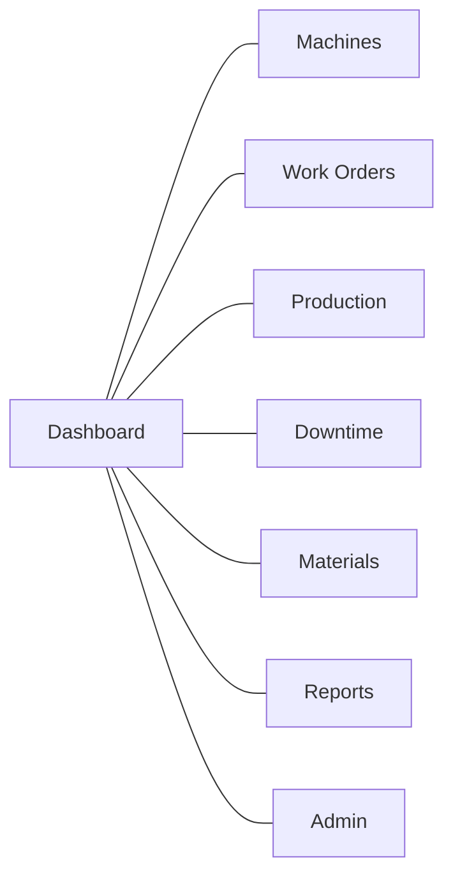
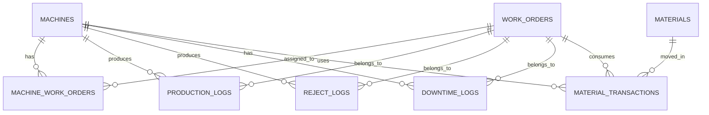

# Project Brief — Work Order & Machine Monitoring System (MES Light)

**Document Type:** Technical Project Brief  
**Target Platform:** Web-based Manufacturing Execution Support System  
**Primary Stack:** ASP.NET Core, Bootstrap, MySQL  
**Version:** 1.0  
**Status:** Draft for Development

---

## 1. Executive Summary

This project is a web-based manufacturing system designed to manage **Work Orders**, monitor **machine status**, record **production output**, capture **rejects and downtime**, and track **material usage** in a manufacturing environment.

The system is intended for use on a shopfloor environment where a large TV display shows machine status and a connected PC/tablet is used for operator input. The system must be simple enough for production use, but structured enough to support industrial requirements such as traceability, audit trail, and scalable future expansion.

---

## 2. Project Background

In many manufacturing plants, production monitoring is still done manually or semi-digitally. Common issues include:

- Machine status is not visible in one central view.
- Work Order execution is not documented consistently.
- Production output is entered manually without traceability.
- Reject and downtime data are hard to analyze.
- Material consumption is not linked properly to production.
- Supervisors must ask operators for current machine conditions.

This project addresses those issues by creating a **centralized production monitoring and execution system**.

---

## 3. Problem Statement

### 3.1 Current Problems

1. Machine status is scattered across multiple sources.
2. Work Order information is displayed, but not structured as a production execution flow.
3. Production input is manual and often inconsistent.
4. Downtime and reject data are difficult to summarize.
5. Material tracking is not directly linked to Work Orders.
6. Historical data is difficult to search and report.
7. The shopfloor screen is only informative, not fully operational.

### 3.2 Core Problems to Solve

- How to show all machines in one dashboard with accurate status.
- How to open one machine and see its current operation summary.
- How to allow operators to input production, reject, and downtime.
- How to connect Work Orders with machine execution and material usage.
- How to structure the system so it is ready for future MES expansion.

---

## 4. Project Objectives

1. Build a production dashboard that shows all machines and their status.
2. Provide a machine detail screen that displays the active Work Order and operation summary.
3. Enable operator input for production, reject, downtime, and material transactions.
4. Store all operational data with a proper audit trail.
5. Design a system structure that is maintainable and scalable.
6. Use a technology stack that is standard and practical for industrial environments.

---

## 5. Project Scope

### 5.1 In Scope

- Machine dashboard
- Machine operation summary
- Work Order management
- Production input
- Reject input
- Downtime input
- Material tracking
- Reporting basics
- Authentication and role-based access
- Audit logging
- Responsive UI for TV and desktop

### 5.2 Out of Scope for Initial Release

- Direct PLC/SCADA integration
- Predictive maintenance
- AI-based analytics
- Complex ERP synchronization
- Advanced scheduling engine
- Mobile app

### 5.3 Future Expansion Candidates

- Real-time machine integration
- OEE calculation
- ERP integration
- Barcode / QR material scanning
- Notification and alert engine
- Multi-plant support

---

## 6. Proposed Technology Stack

### 6.1 Backend

- **ASP.NET Core MVC**
- **Entity Framework Core**
- **ASP.NET Core Identity**
- **SignalR**
- **Serilog** or built-in structured logging

### 6.2 Frontend

- **Bootstrap 5**
- **Razor Views**
- Optional: **Chart.js** for summary charts
- Optional: **JavaScript / jQuery** for interaction helpers

### 6.3 Database

- **MySQL 8.x**

### 6.4 Supporting Tools

- Visual Studio
- Git + GitHub
- MySQL Workbench
- Postman or Swagger for API testing
- Figma or similar for UI mockups
- IIS for deployment
- Windows Server for production hosting

---

## 7. System Roles

### 7.1 Admin

Responsibilities:

- Manage users and roles
- Maintain master data
- Configure system settings
- View all logs and reports

### 7.2 Supervisor / Production Leader

Responsibilities:

- Monitor machine status
- Review Work Orders
- Validate production progress
- Review downtime and rejects

### 7.3 Operator

Responsibilities:

- View assigned machine
- Enter production output
- Record reject
- Record downtime
- Select / confirm Work Order

### 7.4 Engineer / Maintenance (Optional)

Responsibilities:

- Review downtime causes
- Support machine issue resolution
- Analyze production interruption data

---

## 8. High-Level System Architecture



### Architecture Notes

- The TV dashboard is only one presentation surface.
- The actual business rules live in the backend services.
- SignalR is used to refresh machine status in near real-time.
- All production actions are stored in the database with timestamps and user identity.

---

## 9. Application Flow

### 9.1 Main Flow



### 9.2 Machine Status Flow



### 9.3 Operator Workflow



---

## 10. Core Features

## 10.1 Dashboard Overview

The dashboard must show:

- Machine name
- Machine status
- Active Work Order
- Target vs actual production
- Quick summary indicators
- Color-coded condition

### Status Rules

- **RUNNING** = machine is active and producing
- **DOWNTIME** = machine is stopped with active reason
- **OFF** = machine is not active and no downtime is open

---

## 10.2 Machine Operation Summary

When a user clicks a machine, the system opens a detail page showing:

- Work Order ID
- Toy No
- Target
- Part Number
- Panel
- Current machine status
- Production progress
- Reject count
- Active downtime information
- Material usage summary

The page must also provide buttons for:

- Downtime
- Reject
- Work Order
- Production input
- Material input

---

## 10.3 Work Order Management

Work Order module must support:

- Create new Work Order
- Edit Work Order
- Assign Work Order to machine
- Close Work Order
- Reopen / hold Work Order if needed
- Search by WO number, part number, or machine

### Work Order Example Fields

- WO number
- Toy No
- Part Number
- Panel
- Target quantity
- Start date
- End date
- Machine assignment
- Status

---

## 10.4 Production Input

Production module must support:

- Good quantity input
- Reject quantity input
- Timestamp recording
- User recording
- Machine and WO linkage
- Shift recording (optional)

### Rules

- Good and reject quantities must be non-negative.
- Production input must always be tied to a machine and active Work Order.
- Every transaction must be logged.

---

## 10.5 Downtime Management

Downtime module must support:

- Start downtime
- End downtime
- Downtime reason selection
- Duration calculation
- Notes if needed

### Rules

- Downtime should be open only once at a time per machine.
- End time must not be earlier than start time.
- Reason list should be standardized.

---

## 10.6 Material Tracking

Material module must support:

- Issue material to WO
- Return unused material
- Record material consumption
- Optional batch / lot number
- Optional warehouse reference

### Future Traceability Direction

- Material lot → WO → machine → finished product
- This is important for industrial traceability and quality audit.

---

## 10.7 Reporting

Reports should include:

- Production per machine
- Production per Work Order
- Reject summary
- Downtime summary
- Material usage summary
- Daily / shift report

---

## 10.8 Audit Trail

Every important action should store:

- Who did it
- When it happened
- On which machine
- On which Work Order
- Old value / new value when applicable

---

## 11. UI / UX Plan

## 11.1 UI Principles

The interface should be:

- Fast to understand
- Minimal typing
- Large enough for TV display
- Easy for operators in production environment
- Clear color status and strong hierarchy

## 11.2 Visual Design Direction

- Industrial, clean, and functional
- Avoid excessive decoration
- Use strong spacing and readable typography
- Use status colors consistently
- Use card-based layout for machine tiles

### Status Color Suggestion

- RUNNING: Green
- DOWNTIME: Red / Orange
- OFF: Gray
- WARNING / HOLD: Yellow

---

## 11.3 Layout Plan

### A. Dashboard Page

The dashboard should contain:

- Header with plant / line information
- Summary cards
- Machine grid
- Last update time
- Optional quick filters

#### Suggested Layout



### B. Machine Detail Page

The machine detail page should contain:

- Machine header
- Work Order summary block
- Production counters
- Downtime block
- Reject block
- Material block
- Action buttons

#### Suggested Layout



---

## 11.4 Navigation Plan

### Primary Navigation

- Dashboard
- Work Orders
- Machines
- Production Logs
- Downtime Logs
- Materials
- Reports
- Users / Roles
- Settings

### Suggested Navigation Structure



### Navigation Rules

- Dashboard must be accessible in one click.
- Machine detail should open from dashboard tile click.
- Admin menus should only appear for authorized users.
- On TV display, navigation should be reduced to the essentials.

---

## 11.5 Responsive Behavior

- **TV Screen:** dashboard only, large cards, minimal interactions
- **Desktop PC:** dashboard + detail management + data entry
- **Tablet:** simplified detail view and action buttons
- **Mobile (optional):** read-only or limited operator actions

---

## 12. Backend Plan

## 12.1 Backend Architecture

The backend should use a layered architecture:

- **Presentation Layer**: MVC views, controllers
- **Application Layer**: business services
- **Domain Layer**: entities and business rules
- **Infrastructure Layer**: EF Core, MySQL, logging, identity

## 12.2 Recommended Backend Modules

1. Authentication & Authorization
2. Machine Management
3. Work Order Management
4. Production Logging
5. Reject Logging
6. Downtime Logging
7. Material Tracking
8. Reporting
9. Notification / Real-time Updates
10. Audit Logging

---

## 12.3 API Plan

Even if the app is MVC, it is recommended to structure the backend with reusable API-style service boundaries for future expansion.

### Machine APIs

- `GET /api/machines`
- `GET /api/machines/{id}`
- `POST /api/machines`
- `PUT /api/machines/{id}`
- `PATCH /api/machines/{id}/status`

### Work Order APIs

- `GET /api/workorders`
- `GET /api/workorders/{id}`
- `POST /api/workorders`
- `PUT /api/workorders/{id}`
- `POST /api/workorders/{id}/assign-machine`
- `POST /api/workorders/{id}/close`

### Production APIs

- `POST /api/production`
- `GET /api/production/machine/{id}`
- `GET /api/production/workorder/{id}`

### Reject APIs

- `POST /api/rejects`
- `GET /api/rejects/machine/{id}`

### Downtime APIs

- `POST /api/downtimes/start`
- `POST /api/downtimes/end`
- `GET /api/downtimes/machine/{id}`

### Material APIs

- `POST /api/material-transactions`
- `GET /api/material-transactions/machine/{id}`
- `GET /api/material-transactions/workorder/{id}`

### Reporting APIs

- `GET /api/reports/daily`
- `GET /api/reports/machine-summary`
- `GET /api/reports/workorder-summary`

---

## 12.4 SignalR / Real-Time Plan

Use SignalR for:

- machine status updates
- production counter refresh
- downtime state changes
- dashboard alerts

### Real-Time Event Examples

- machine status changed
- production input submitted
- downtime started
- downtime closed
- work order changed

---

## 12.5 Background Jobs

Background services can be used for:

- status recalculation
- daily summary generation
- scheduled clean-up
- data synchronization
- alert generation

---

## 13. Database Plan

## 13.1 Database Design Principles

- Normalize core transaction data
- Separate master data from transaction data
- Keep audit fields on all important tables
- Use consistent naming conventions
- Index fields that are used in filters and joins

---

## 13.2 Core Tables

### machines

Stores machine master data.

Suggested columns:

- id
- machine_code
- machine_name
- line_name
- status
- is_active
- created_at
- updated_at

---

### work_orders

Stores Work Order master and execution data.

Suggested columns:

- id
- wo_number
- toy_no
- part_number
- panel
- target_qty
- start_date
- end_date
- status
- created_at
- updated_at

---

### machine_work_orders

Stores machine assignment history.

Suggested columns:

- id
- machine_id
- work_order_id
- start_time
- end_time
- status
- assigned_by
- created_at

---

### production_logs

Stores good output production transactions.

Suggested columns:

- id
- machine_id
- work_order_id
- qty_good
- shift_name
- notes
- created_by
- created_at

---

### reject_logs

Stores reject transactions.

Suggested columns:

- id
- machine_id
- work_order_id
- qty_reject
- reject_reason
- notes
- created_by
- created_at

---

### downtime_logs

Stores downtime events.

Suggested columns:

- id
- machine_id
- work_order_id
- downtime_reason_id
- start_time
- end_time
- duration_minutes
- notes
- created_by
- created_at

---

### materials

Stores raw material master data.

Suggested columns:

- id
- material_code
- material_name
- unit
- is_active
- created_at
- updated_at

---

### material_transactions

Stores material movement.

Suggested columns:

- id
- material_id
- work_order_id
- machine_id
- transaction_type
- qty
- batch_no
- notes
- created_by
- created_at

---

### downtime_reasons

Stores standardized downtime reasons.

Suggested columns:

- id
- reason_code
- reason_name
- category
- is_active

---

### users / roles

Use ASP.NET Core Identity tables for authentication and authorization.

---

## 13.3 Relationship Overview



---

## 13.4 Database Rules

- One active Work Order per machine at a time unless business rules allow otherwise.
- One open downtime record per machine at a time.
- All quantity values must be non-negative.
- Each transaction must have timestamp and user ID.
- Every status update should be traceable.

---

## 14. Business Rules

1. A machine can be **Running**, **Off**, or **Downtime**.
2. A machine must always have a clear current state.
3. Production input must be tied to an active Work Order.
4. Reject input must reference machine and Work Order.
5. Downtime must have a reason and a time window.
6. Material issue must be linked to Work Order.
7. Closing a Work Order should freeze execution data.
8. Historical records should not be overwritten; they should be appended or versioned.

---

## 15. Validation Rules

### Input Validation

- WO number must be unique.
- Target quantity must be greater than zero.
- Production and reject quantities must be valid integers.
- Downtime end time must be greater than start time.
- Machine assignment must be valid and active.
- Material quantity cannot exceed current stock unless business rule permits.

### UI Validation

- Disable irrelevant actions when a machine is off.
- Show warning if no active WO exists.
- Confirm before closing downtime or WO.
- Use dropdowns for standardized fields.

---

## 16. Non-Functional Requirements

### Performance

- Dashboard should load quickly.
- Machine cards should update efficiently.
- Queries should be indexed for common filters.

### Reliability

- Data should not be lost on refresh.
- Transactions should be saved atomically.

### Maintainability

- Code must be modular.
- Services must be separated from views.
- Database migrations must be used properly.

### Security

- Authentication required for operator actions.
- Role-based access must be enforced.
- Sensitive actions should be logged.

### Usability

- Large controls for production environment.
- Minimal steps for operator actions.
- Clear labeling and color usage.

---

## 17. Development Roadmap

## Phase 1 — Foundation

- Setup ASP.NET Core project
- Setup MySQL
- Setup EF Core
- Setup Identity
- Setup Bootstrap layout
- Create base navigation

## Phase 2 — Master Data

- Machine CRUD
- Work Order CRUD
- Material master
- Downtime reason master
- User / role management

## Phase 3 — Execution Core

- Dashboard machine tiles
- Machine detail page
- Production input
- Reject input
- Downtime input
- Work Order assignment

## Phase 4 — Material Tracking

- Material transaction screen
- Material usage by Work Order
- Material report

## Phase 5 — Real-Time and Reporting

- SignalR updates
- Summary cards
- Daily report
- Machine history
- Work Order summary

## Phase 6 — Hardening

- Validation improvements
- Audit logs
- Exception handling
- Logging enhancements
- UAT with production users

## Phase 7 — Deployment

- Publish to IIS
- Production connection string
- Environment configuration
- Backup strategy
- Monitoring

---

## 18. Testing Plan

### Unit Testing

Test:

- business logic
- status calculation
- transaction validation

### Integration Testing

Test:

- database connection
- CRUD flow
- Work Order assignment
- production and downtime saving

### User Acceptance Testing

Test with:

- operator
- supervisor
- admin

### Scenario Testing

- machine running and input production
- machine downtime start/stop
- WO change during execution
- reject logging
- material transaction flow

---

## 19. Deployment Plan

### Environment Separation

- Development
- Staging
- Production

### Deployment Targets

- IIS on Windows Server
- SQL / MySQL production server
- optional reverse proxy if needed

### Production Checklist

- correct connection string
- logging enabled
- error page configured
- database backup scheduled
- user roles validated
- health check verified

---

## 20. Risks and Mitigation

| Risk                     | Impact               | Mitigation                                             |
| ------------------------ | -------------------- | ------------------------------------------------------ |
| Manual input error       | Data inaccuracy      | Validation, clear UI, fewer input fields               |
| User resistance          | System not used      | Simple UI, training, operator-friendly flow            |
| Poor data structure      | Hard maintenance     | Clean database schema, layered architecture            |
| Slow dashboard           | Poor user experience | Indexing, pagination, SignalR refresh only when needed |
| Undefined business rules | Confusion            | Confirm rules before development                       |
| Scope creep              | Delayed delivery     | Prioritize core features first                         |

---

## 21. Recommended Design Decisions

1. Start with **manual input first** before machine integration.
2. Focus on **one machine detail flow** before building advanced reports.
3. Keep TV dashboard simple and fast.
4. Use **database-driven status** instead of hardcoded logic.
5. Build with a layered structure so future expansion is easy.
6. Keep operator actions to the minimum number of clicks.
7. Log every important action.

---

## 22. Definition of Done

The initial project is considered complete when:

- User can log in.
- Dashboard shows all machines.
- User can open a machine detail page.
- User can assign or view a Work Order.
- User can input production output.
- User can input reject data.
- User can record downtime.
- User can manage material transactions.
- Reports can be generated.
- Data is stored safely in MySQL.
- System is deployable on IIS.

---

## 23. Suggested Repository Structure

```text
/src
  /Web
    Controllers
    Views
    wwwroot
    Hubs
  /Application
    Services
    DTOs
    Interfaces
  /Domain
    Entities
    Enums
    ValueObjects
  /Infrastructure
    Data
    Migrations
    Repositories
    Logging
  /Tests
    UnitTests
    IntegrationTests
/docs
  project-brief.md
  architecture.md
  api-spec.md
  database-design.md
```

---

## 24. Final Notes

This project should be developed as a **production-ready industrial web system**, not just as a prototype. The first release should be simple, stable, and aligned with real operator workflow. Once the core flow is stable, the system can be expanded toward a full MES platform.

The most important principle is:

> **Build the workflow that the factory will actually use.  
> Then improve it step by step.**

---

## 25. Appendix — Suggested First Implementation Order

1. Login and role access
2. Machine master
3. Work Order master
4. Dashboard machine tiles
5. Machine detail page
6. Production input
7. Reject input
8. Downtime input
9. Material transaction input
10. Reports
11. Real-time refresh
12. Hardening and deployment
